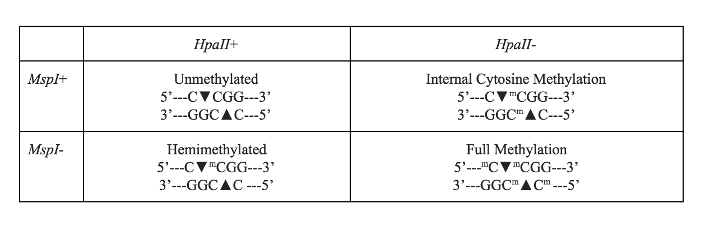

## Methods

### Study Species & Locale

*Araptus attenuatus* Wood (Curculionidae) is a bark beetle endemic to the Sonoran desert and known only to inhabit the senescing stems of the Euphorb *Euphorbia lomelii* (Garrick *et al.* 2013).  Both plant and insect are co-distributed throughout the Sonoran desert in Baja California, Mexico with at least two relictual populations in the mainland states of Sonora and Sinaloa.  The distribution of spatial genetic structure in both host plant and insect reveal marked phylogeographic structuring (Garrick *et al.* 2009, 2013) with clear evidence of post-Pleistocene range expansion, multiple glacial refugia, and clear spatial partitioning on the existing desert landscape.  Throughout its range, the genetic structure of *A. attenuatus* suggests cryptic speciation with mtDNA sequence divergence of 8-12% separating clades—one on mainland Mexico and two sharing a zone of sympatry in the southern region of the Baja California peninsula.  

For this project, individuals were sampled from locales known to be of only the largest and main mtDNA clade from peninsular Baja California.  Previous work in this species has revealed a clade-specific diagnostic SNP marker, which all individuals were screened to ensure observed genetic and epigeneic differences were consistent with a monophyletic history.  Individuals were from twenty populations were sampled.  Since the original sampling included collecting several individuals from each of up to 10 plants per site and subsequent analyses have suggested that individual in the same plant are related, only a single animal was selected from each host plant at each site.


### Methylation-Sensitive AFLP 

Genomic DNA was extracted using the Qiagen DNA Blood and Tissue extraction kit (Qiagen Inc, Natick MA), deviating only from the manufacturers standard protocol by an overnight extension of the protenase-K incubation period and resuspension in DNase/RNase free water rather than the "EB" elution buffer as EDTA has been shown to inhibit downstream AFLP analyses.  The presence of methylation was identified using methylation-sensitive AFLP analyses.  This approach extends the traditional Amplified Fragment Length Polymorphism (AFLP) approach by pairing a one of the normal cutting enzymes with a methylation sensitive isoschizomer.  For our purposes, we paired the *MspI* enzyme, which is not sensitive to the presence of cytosine methylation with *HpaII*, which is inhibited from cutting template DNA in the presence of methylation.  Divergent fragment profiles for the same template DNA cut individually with both *MspI* and *HpaII* reveal the presence of cytosize methylation (see Figure X).  

```{r fig.cap="<i>Figure X:</i> Divergent msAFLP banding patterns for isoschizomers reveal the presence and absence of cytosine methylation at the target cut site.  The nucleotide sequences represent the recognition cut sites for <i>MspI/HpaII</i> with cleavage indicated by the filled diamonds.  The superscript letter 'm' represents the presnce of a methyl group on the attached cytosine residue."}

```

Primary digestion with *MspI* and *HpaII* followed the standard protocol of Fulneček & Kovařík (2014).  Template DNA concentrations were standardized to 200ng.  A pair of template DNA alloquots from each animal was digested with *EcoRI*/*MspI* and *EcoRI*/*HpaII*.  Restriction digests were incubated at 37&deg;C for 3 hours, followed by enzyme inactivation at 80&deg;C for 20 minutes.  Primers for both the *EcoRI* and *MspI*/*HpaII* sticky fragment ends were ligated using T4 DNA Ligase (New England Biolabs; Table X) at standard concentrations with an overnight incubation at 16&deg;C.


```{r}
adapters <- data.frame( Target = c("<i>Adaptors</i>",
                                   "EcoRI-F",
                                   "EcoRI-R",
                                   "HPAII/MspI-F",
                                   "HPAII/MspI-R",
                                   "<i>Preselective Primers</i>",
                                   "EcoRI + A",
                                   "HPAII/MspI + C",
                                   "<i>Selective Primers</i>",
                                   "EcoRI + ACT",
                                   "HPAII/MspI + CGT"))
adapters$Sequences <- c("",
                        "5’-CTCGTAGACTGCGTACC",
                        "5’-AATTGGTACGCAGTCTAC",
                        "5’-GACGATGAGTCCTGAG",
                        "5’-CGCTCAGGACTCAT",
                        "",
                        "5’-GACTGCGTACCAATTCA",
                        "5’-GACGATGAGTCCTGAGCGGC",
                        "",
                        "5’-GACTGCGTACCAATTCACT",
                        "5’-GACGATGAGTCCTGAGCGGCGT")
knitr::kable(adapters,caption="Table X: Adapters and primers sets used for msAFLP band selection.")
```

A subset of fragments from the paired *EcoRI*/*MspI* and *EcoRI*/*HpaII* digests were amplifed using the normal 2-step process.  A pre-selective amplification consisted of 10 µl of digested-ligated product, 0.8 µM each of *EcoRI + A* primer, and *HpaII/MspI + C* primer (Table X), 10X polymerase chain reaction (PCR) buffer, 1.5 µl 50 µM MgCl<sub>2</sub>, 4 µl 10 mM deoxynucleoside triphosphates (dNTPs), and 0.5 µl 5U/µl Taq DNA polymerase. PCR reaction conditions were: 75 °C for 2 minute, followed by 20 cycles of 94 °C for 50 seconds, 56 °C for 1 minute, and 72 °C for 2 minutes, and a final extension for 30 minutes at 60 °C.  Pre-selective PCR products were diluted 50 X in sterile water prior to the selective amplification.

The Selective Amplification step was conducted using a 2X Type-It Microsatellite PCR kit, in a volume of 25 µl, using 10 µl of the diluted PCR product from the pre-selective amplification. This reaction was performed using 12.5 µl 2x Type-it Multiplex PCR Master mix, 2.5 µl 2µM of each primer – *EcoRI + ACT*, and *MspI/HpaII + CGT*. The EcoRI primer was pre-labeled with tetrachlorinated analogue of 6-carboxyfluorescein (6-*FAM*). The PCR parameters included a heat inactivation step at 95 °C for 5 min, followed by a 3-step cycling process, for 28 cycles – a denaturation step at 95 °C for 30 s, an annealing step at 63 °C for 90 s, and lastly an extension step 72 °C for 30 s. Samples were cleaned of unused primers and other oligonucleotides using the EXO-SAP IT kit (USB Co., Amersham).

Each animal sample was assayed for both a non-methylation sensitive (NUC) marker profile using the *EcoRI+MspI* combination of enzymes and a methylation sensitive (METH) genetic marker profile using *EcoRI+HPAII*.  In the absence of methylation, the presence or absence of DNA fragments will be identical in NUC and METH profiles, whereas with methylation, either as a hemimethylated cytosine or as a methylation site on the internal cytosine residue, NUC and METH will produce different methylation profiles (see again Figure 1). We interpret these presence/absence band profiles as either denoting an unmethylated state (+/+), a methylated state (+/-) or (-/+), or an uninformative state (-/-).

Fragments from both NUC and METH profiles were identified using an ABI3730xl DNA Analyzer (Applied Biosystems, Inc.), using LIZ500 (orange) as the size standard.  Individual trace files for each trace were analyzed using the ‘Binner’ package (version 0.1, Smith 2014 ) in R (version 3.0.1).  Bin sizes for fragments were set to be in the range of 1-1.5bp in width.  Profiles were generated automatically and then checked by hand.  Duplicate samples were run for QA/QC.  Bands with poor repeatability (e.g., error rates in duplicate runs exceeding 5%) were dropped from the analyses (see again Table 1).  Bins were defined based upon NUC profiles and then METH profiles were called using the same classification scheme.  Individual fragments were converted to AFLP genetic markers (absence/presence of fragment) for each locus using the `gstudio` R library (Dyer, 2017). 

### Analyses

Sizing of AFLP fragments for both NUC and METH profiles were conducted using the `msap` R package (version 1.1.8 Pérez-Figueroa 2014).  Fragment sizes were estimated based upon the methylation insensitive profiles (NUC) after which METH profiles were scored.  Estimates of methylation frequencies (unmethylated, hemimethylated, internal cytosine methylation, and full methylation) were estimated across all data.  Band fragments were filtered based upon both frequency and QA/QC with the removal of any bands whose global frequency was less than 5% and whose repeatability across replicate runs exceeded a 5% scoring error.  


  
